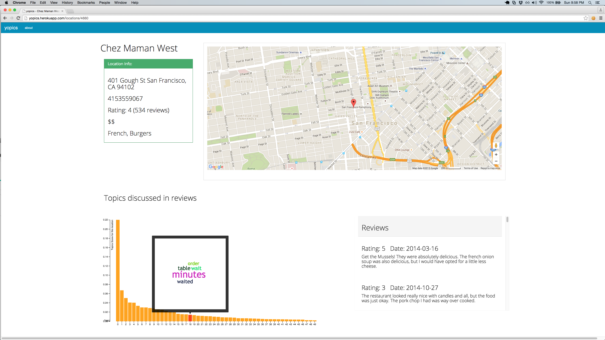

#Yopics - Yelp Review Topic Modeling

This Node.js, Flask and PostgreSQL app models topics in Yelp reviews in order to succinctly display prominent topics for all reviews of a location. Users then better understand which features scores reflect. Scraped 1.1mil reviews in one day + 1.6mil from Yelp academic dataset. Data sci + machine learning + web application + D3 data viz. 

<a href="http://prezi.com/1yy4lqqxevdb/?utm_campaign=share&utm_medium=copy" target="_blank">Brief overview of app</a>

Flask Repo: https://github.com/emoreno619/yelpData

App in Action: https://yopics.herokuapp.com/

Cut to the chase (example of a location topic model): http://yopics.herokuapp.com/locations/5568

This program scraped about 800,000 unique reviews from yelp (scraped 1.1 million in one day, some were redundant). It is an expansion of another project, [sentimentAnalysis](https://github.com/emoreno619/sentimentAnalysis) For further explanation, see my blog https://medium.com/@emoreno619

Documentation of procedure that produced data set:

1) searched on Yelp for 'food' in each city (on 8/4/15)

2) collected yelp urls of first 1000 locations (total of >11k) that resulted
   for each city
   
3) cities are 10 largest US cities by population + San Francisco (including
   in no particular order: NYC, LA, Chicago, San Jose, Houston, Dallas, San
   Diego, San Antonio, Philadelphia, Phoenix)
   
4) Note: my getUrls() scraping algorithm isn't the most efficient,
   and in fact contains much repetition and includes sponsored results.
   So, the data produced by that algorithm was tidied in postgres, by
   removing duplicates and designated sponsored, advertisement results
